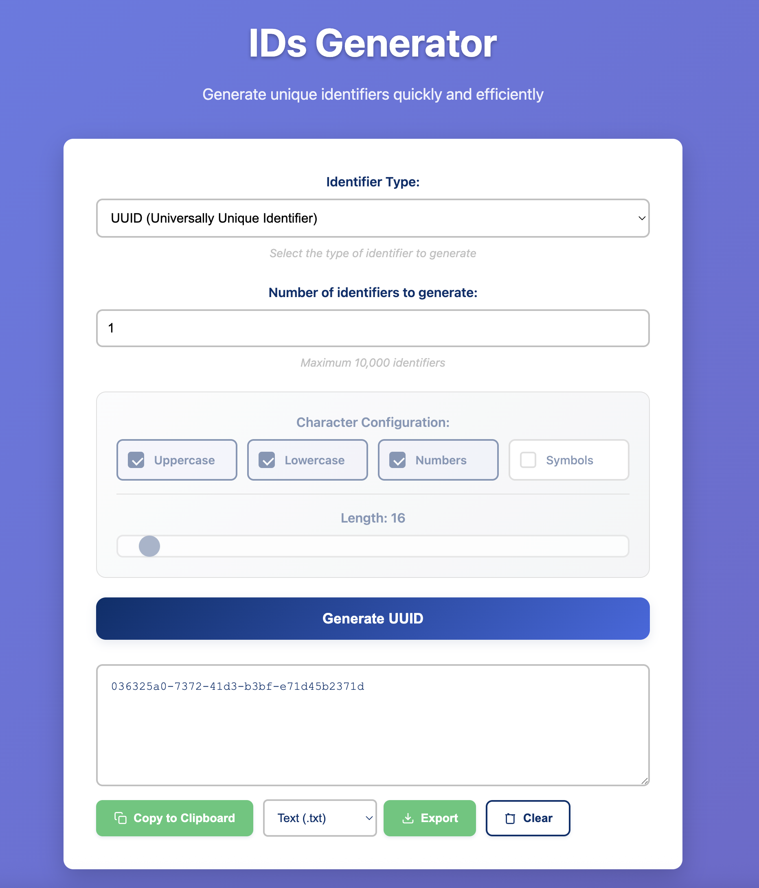
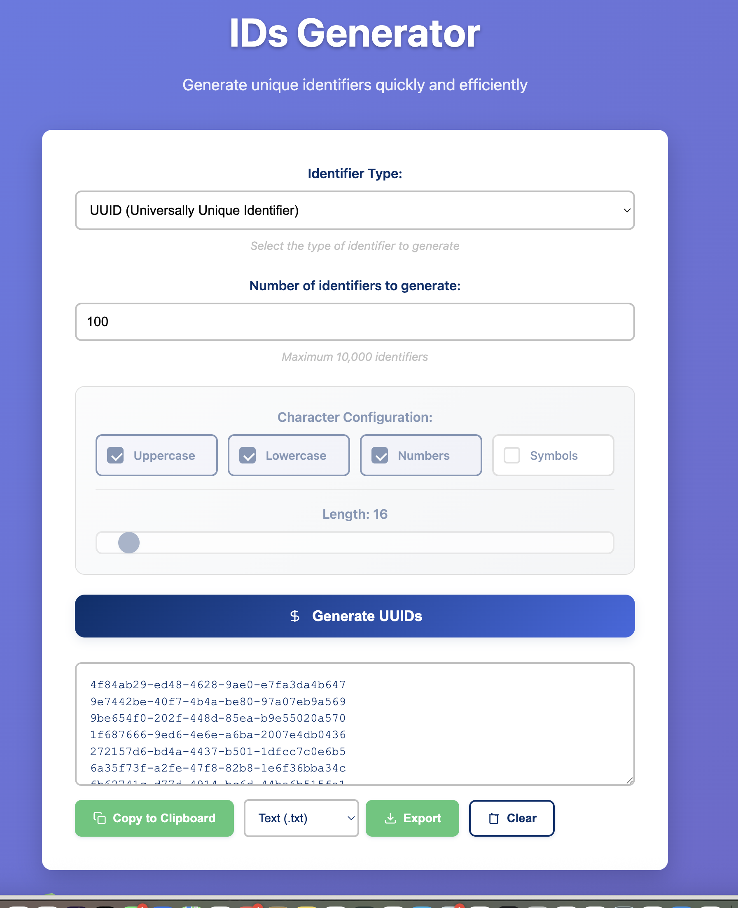

# UUID Generator

[](https://www.gnu.org/licenses/gpl-3.0)
[](https://github.com/username/uuid-generator/releases)
[](https://github.com/username/uuid-generator/issues)
[](https://github.com/username/uuid-generator/stargazers)

A simple, fast, and secure UUID v4 generator web application that allows you to generate single or multiple UUIDs (up to 10,000 at once) with convenient copy and export functionality.

## 🚀 Features

- **Single & Bulk Generation**: Generate 1 to 10,000 UUIDs at once
- **Copy to Clipboard**: One-click copy functionality with visual feedback
- **Multiple Export Formats**: Download as TXT, CSV, or JSON
- **Responsive Design**: Works perfectly on desktop, tablet, and mobile devices
- **No Dependencies**: Pure vanilla JavaScript, HTML, and CSS
- **Privacy Focused**: All generation happens client-side, no data sent to servers
- **Fast Performance**: Optimized for generating large batches quickly
- **Accessibility**: Full keyboard navigation and screen reader support
- **Modern UI**: Clean, intuitive interface with smooth animations

## 📸 Screenshots


*Main interface showing UUID generation and export options*


*Bulk generation of multiple UUIDs with export functionality*

## 🛠️ Installation

### Option 1: Download Release

1. Download the latest release from [GitHub Releases](https://github.com/username/uuid-generator/releases)
2. Extract the files to your desired directory
3. Open `index.html` in your web browser

### Option 2: Clone Repository

```bash
git clone https://github.com/username/uuid-generator.git
cd uuid-generator
```

Then open `index.html` in your web browser.

### Option 3: Use with Web Server

```bash
# Using Python 3
python -m http.server 8000

# Using Node.js (with http-server)
npx http-server

# Using PHP
php -S localhost:8000
```

Then navigate to `http://localhost:8000`

## 🚀 Quick Start

1. **Generate Single UUID**: Click "Generate UUIDs" with default quantity (1)
2. **Generate Multiple UUIDs**: Enter desired quantity (1-10,000) and click "Generate UUIDs"
3. **Copy UUIDs**: Click the copy button to copy all generated UUIDs to clipboard
4. **Export UUIDs**: Select format (TXT, CSV, JSON) and click "Export" to download

## 📖 Usage

### Basic Usage

1. Open the application in your web browser
2. Enter the number of UUIDs you want to generate (1-10,000)
3. Click "Generate UUIDs"
4. Use the copy button to copy UUIDs to clipboard
5. Or use the export dropdown to download in your preferred format

### Export Formats

- **TXT**: Plain text, one UUID per line
- **CSV**: Comma-separated values with header
- **JSON**: Structured JSON with metadata (generation time, count)

### Keyboard Shortcuts

- `Enter`: Generate UUIDs
- `Ctrl+C` / `Cmd+C`: Copy UUIDs (when results are visible)
- `Escape`: Clear results

## 🔧 Development

### Prerequisites

- Modern web browser (Chrome 60+, Firefox 55+, Safari 12+, Edge 79+)
- Text editor or IDE
- Optional: Local web server for development

### Project Structure

```
uuid-generator/
├── index.html          # Main HTML file
├── styles.css          # Stylesheet
├── script.js           # JavaScript functionality
├── README.md           # This file
├── LICENSE             # GNU GPL v3 License
├── .gitignore          # Git ignore rules
├── docs/               # Documentation
│   ├── architecture.md # Architecture documentation
│   ├── development.md  # Development guide
│   ├── usage.md        # User guide
│   └── integration.md  # Integration guide
└── .github/            # GitHub configuration
    └── workflows/      # CI/CD workflows
        └── deploy.yml  # Deployment workflow
```

### Local Development

1. Clone the repository
2. Make your changes
3. Test in multiple browsers
4. Run the test suite (if applicable)
5. Submit a pull request

For detailed development instructions, see [Development Guide](docs/development.md).

## 🏗️ Architecture

The application follows a simple client-side architecture:

- **Frontend**: Vanilla HTML, CSS, JavaScript
- **UUID Generation**: RFC 4122 compliant UUID v4 algorithm
- **No Backend**: Completely client-side for privacy and simplicity
- **No Dependencies**: Self-contained with no external libraries

For detailed architecture information, see [Architecture Documentation](docs/architecture.md).

## 🔌 Integration

The UUID Generator can be easily integrated into other projects:

### As a Component

```javascript
// Extract the UUID generation function
function generateUUID() {
    return 'xxxxxxxx-xxxx-4xxx-yxxx-xxxxxxxxxxxx'.replace(/[xy]/g, function(c) {
        const r = Math.random() * 16 | 0;
        const v = c === 'x' ? r : (r & 0x3 | 0x8);
        return v.toString(16);
    });
}

// Generate multiple UUIDs
const uuids = Array.from({ length: 10 }, () => generateUUID());
```

### As a Module

```javascript
import { UUIDGenerator } from './uuid-generator.js';

const generator = new UUIDGenerator();
const uuid = generator.generateUUID();
```

For comprehensive integration examples, see [Integration Guide](docs/integration.md).

## 🧪 Testing

### Manual Testing

1. Test UUID generation with various quantities
2. Verify copy-to-clipboard functionality
3. Test export in all formats
4. Check responsive design on different screen sizes
5. Validate accessibility with keyboard navigation

### Automated Testing

```bash
# Run unit tests (if implemented)
npm test

# Run browser tests
npm run test:browser

# Run accessibility tests
npm run test:a11y
```

## 🌐 Browser Support

| Browser | Version | Status |
|---------|---------|--------|
| Chrome  | 60+     | ✅ Full Support |
| Firefox | 55+     | ✅ Full Support |
| Safari  | 12+     | ✅ Full Support |
| Edge    | 79+     | ✅ Full Support |
| IE      | 11      | ⚠️ Limited Support |

## 🔒 Security

- **Client-Side Only**: No data is sent to external servers
- **Cryptographically Secure**: Uses `Math.random()` for UUID generation
- **No Data Storage**: UUIDs are not stored or logged
- **CSP Compatible**: Works with Content Security Policy
- **HTTPS Ready**: Fully compatible with HTTPS deployment

## 📊 Performance

- **Fast Generation**: Can generate 10,000 UUIDs in under 100ms
- **Memory Efficient**: Minimal memory footprint
- **No Network Requests**: Completely offline capable
- **Small Bundle Size**: Under 50KB total (HTML + CSS + JS)

## 🤝 Contributing

We welcome contributions! Please see our [Contributing Guidelines](CONTRIBUTING.md) for details.

### How to Contribute

1. Fork the repository
2. Create a feature branch (`git checkout -b feature/amazing-feature`)
3. Commit your changes (`git commit -m 'Add amazing feature'`)
4. Push to the branch (`git push origin feature/amazing-feature`)
5. Open a Pull Request

### Development Setup

```bash
# Clone your fork
git clone https://github.com/yourusername/uuid-generator.git
cd uuid-generator

# Create a branch for your feature
git checkout -b feature/your-feature-name

# Make your changes and test
# ...

# Commit and push
git add .
git commit -m "Description of your changes"
git push origin feature/your-feature-name
```

## 📝 Changelog

### [1.0.0] - 2025-01-XX

#### Added
- Initial release
- UUID v4 generation (single and bulk)
- Copy to clipboard functionality
- Export to TXT, CSV, JSON formats
- Responsive web design
- Comprehensive documentation
- Accessibility features
- Keyboard shortcuts

For detailed changelog, see [CHANGELOG.md](CHANGELOG.md).

## 🗺️ Roadmap

- [ ] **v1.1.0**: Add UUID validation tool
- [ ] **v1.2.0**: Support for other UUID versions (v1, v3, v5)
- [ ] **v1.3.0**: Batch processing with progress indicators
- [ ] **v1.4.0**: Custom export templates
- [ ] **v1.5.0**: API integration options
- [ ] **v2.0.0**: PWA (Progressive Web App) support

## ❓ FAQ

### What is a UUID?

A UUID (Universally Unique Identifier) is a 128-bit number used to identify information in computer systems. The version 4 UUIDs generated by this tool are random and have a very low probability of collision.

### Are the generated UUIDs truly unique?

UUID v4 uses random numbers and has a collision probability so low it's considered negligible for practical purposes (approximately 1 in 5.3 x 10^36).

### Is this tool secure for production use?

Yes, the tool generates cryptographically strong UUIDs suitable for production use. All generation happens client-side, ensuring privacy.

### Can I use this offline?

Yes, once loaded, the application works completely offline as it requires no server communication.

### What's the maximum number of UUIDs I can generate?

You can generate up to 10,000 UUIDs at once. This limit ensures good performance across all devices.

## 📞 Support

- **Documentation**: Check the [docs](docs/) folder for detailed guides
- **Issues**: Report bugs or request features via [GitHub Issues](https://github.com/username/uuid-generator/issues)
- **Discussions**: Join the conversation in [GitHub Discussions](https://github.com/username/uuid-generator/discussions)
- **Email**: Contact us at support@example.com

## 📄 License

This project is licensed under the GNU General Public License v3.0 - see the [LICENSE](LICENSE) file for details.

### What this means:

- ✅ **Commercial Use**: You can use this software commercially
- ✅ **Modification**: You can modify the software
- ✅ **Distribution**: You can distribute the software
- ✅ **Patent Use**: You can use any patents related to the software
- ✅ **Private Use**: You can use the software privately
- ❗ **Disclose Source**: You must disclose the source code when distributing
- ❗ **License and Copyright Notice**: You must include the license and copyright notice
- ❗ **Same License**: Derivative works must use the same license
- ❗ **State Changes**: You must document any changes made to the software

## 🙏 Acknowledgments

- [RFC 4122](https://tools.ietf.org/html/rfc4122) - UUID specification
- [MDN Web Docs](https://developer.mozilla.org/) - Web development documentation
- [Can I Use](https://caniuse.com/) - Browser compatibility data
- Contributors and users who provide feedback and improvements

## 🔗 Related Projects

- [uuid](https://github.com/uuidjs/uuid) - UUID library for Node.js
- [Online UUID Generator](https://www.uuidgenerator.net/) - Alternative online tool
- [UUID Tools](https://github.com/uuid-tools) - Collection of UUID utilities

---

<div align="center">

**[⬆ Back to Top](#uuid-generator)**

Made with ❤️ by the UUID Generator Team

[Website](https://username.github.io/uuid-generator/) • [Documentation](docs/) • [Issues](https://github.com/username/uuid-generator/issues) • [License](LICENSE)

</div>